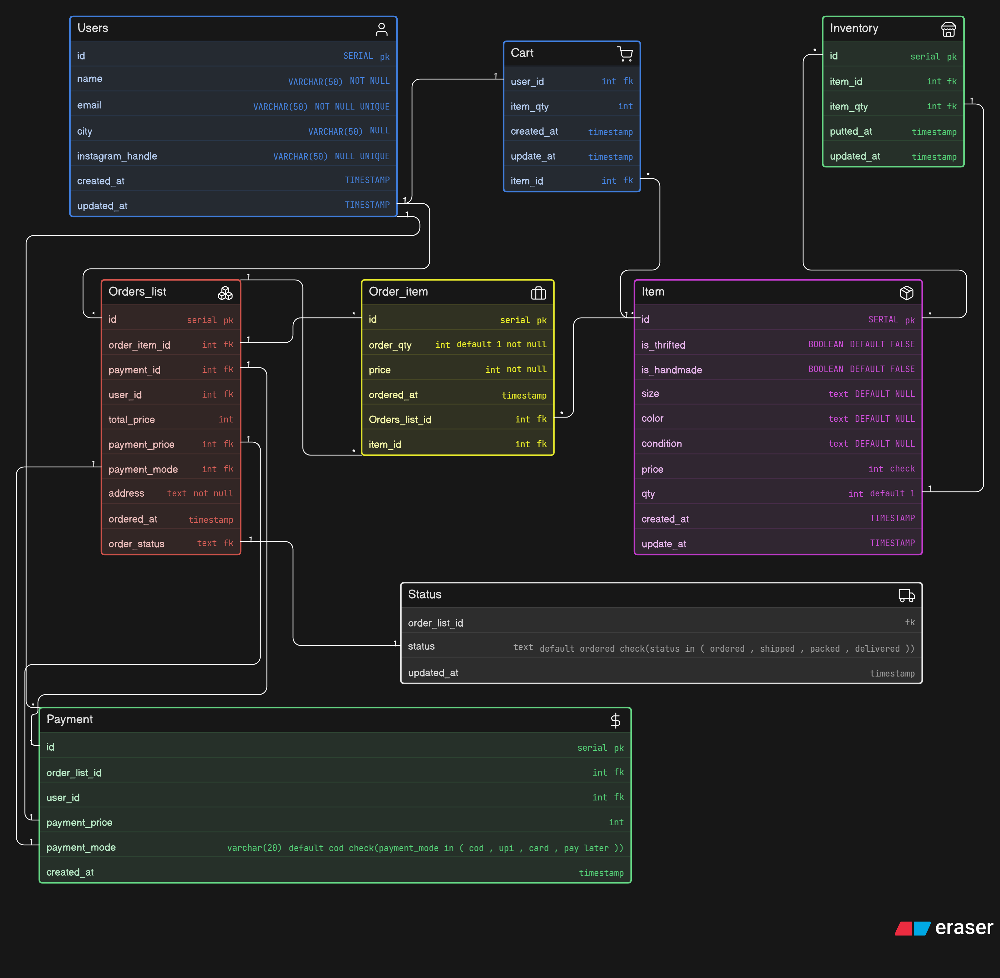

# 🛍️ E-Commerce Database Design

A relational database schema for a thrift/handmade e-commerce platform supporting users, product inventory, cart management, order processing, payments, and delivery tracking.

Trust me readme is Ai generated but database is generated by brain.exe

---

## 📐 Schema Diagram



---

## 📦 Tables Overview

### 👤 Users
Stores customer account information.

| Column | Type | Constraints |
|---|---|---|
| id | SERIAL | PRIMARY KEY |
| name | VARCHAR(50) | NOT NULL |
| email | VARCHAR(50) | NOT NULL, UNIQUE |
| city | VARCHAR(50) | NULL |
| instagram_handle | VARCHAR(50) | NULL, UNIQUE |
| created_at | TIMESTAMP | |
| updated_at | TIMESTAMP | |

---

### 📦 Item
Represents individual products listed on the platform, supporting thrifted and handmade items.

| Column | Type | Constraints |
|---|---|---|
| id | SERIAL | PRIMARY KEY |
| is_thrifted | BOOLEAN | DEFAULT FALSE |
| is_handmade | BOOLEAN | DEFAULT FALSE |
| size | TEXT | DEFAULT NULL |
| color | TEXT | DEFAULT NULL |
| condition | TEXT | DEFAULT NULL |
| price | INT | CHECK |
| qty | INT | DEFAULT 1 |
| created_at | TIMESTAMP | |
| update_at | TIMESTAMP | |

---

### 🏪 Inventory
Tracks stock levels for items in the store.

| Column | Type | Constraints |
|---|---|---|
| id | SERIAL | PRIMARY KEY |
| item_id | INT | FOREIGN KEY → Item.id |
| item_qty | INT | FOREIGN KEY → Item.qty |
| putted_at | TIMESTAMP | |
| updated_at | TIMESTAMP | |

---

### 🛒 Cart
Holds items a user has added to their cart before checkout.

| Column | Type | Constraints |
|---|---|---|
| user_id | INT | FOREIGN KEY → Users.id |
| item_id | INT | FOREIGN KEY → Item.id |
| item_qty | INT | |
| created_at | TIMESTAMP | |
| update_at | TIMESTAMP | |

---

### 📋 Orders_list
Represents a placed order by a user.

| Column | Type | Constraints |
|---|---|---|
| id | SERIAL | PRIMARY KEY |
| user_id | INT | FOREIGN KEY → Users.id |
| total_price | INT | |
| payment_price | INT | FOREIGN KEY → Payment.payment_price |
| order_item_id | INT | FOREIGN KEY → Order_item.id |
| payment_id | INT | FOREIGN KEY → Payment.id |
| payment_mode | INT | FOREIGN KEY → Payment.payment_mode |
| address | TEXT | NOT NULL |
| order_status | TEXT | FOREIGN KEY → Status.status |
| ordered_at | TIMESTAMP | |

---

### 🧾 Order_item
Line-item details for each product within an order.

| Column | Type | Constraints |
|---|---|---|
| id | SERIAL | PRIMARY KEY |
| Orders_list_id | INT | FOREIGN KEY → Orders_list.id |
| item_id | INT | FOREIGN KEY → Item.id |
| order_qty | INT | DEFAULT 1, NOT NULL |
| price | INT | NOT NULL |
| ordered_at | TIMESTAMP | |

---

### 🚚 Status
Tracks the delivery/fulfilment status of an order.

| Column | Type | Constraints |
|---|---|---|
| order_list_id | INT | FOREIGN KEY → Orders_list.id |
| status | TEXT | DEFAULT `ordered`, CHECK (`ordered`, `shipped`, `packed`, `delivered`) |
| updated_at | TIMESTAMP | |

---

### 💳 Payment
Records payment details linked to an order and user.

| Column | Type | Constraints |
|---|---|---|
| id | SERIAL | PRIMARY KEY |
| order_list_id | INT | FOREIGN KEY → Orders_list.id |
| user_id | INT | FOREIGN KEY → Users.id |
| payment_price | INT | |
| payment_mode | VARCHAR(20) | DEFAULT `cod`, CHECK (`cod`, `upi`, `card`, `pay later`) |
| created_at | TIMESTAMP | |

---


## 🔗 Relationships
 
```
Users.id < Orders_list.id                        // A single User can have multiple order list
Orders_list.order_item_id < Order_item.id        // A single list can have multiple order_item
Orders_list.payment_id - Payment.id              // A single order list will have single payment id
Orders_list.payment_price - Payment.payment_price // A single list will have single price and single price will belong to a single list
Order_item.Orders_list_id > Orders_list.id       // A single Order_item will belong to a single list and a single list can have multiple ordered item
Orders_list.order_status - Status.status
Orders_list.payment_mode - Payment.payment_mode  // A single list will have single Payment mode and single payment will be connected to single payment
Payment.id > Users.id                            // A User can have many payment id but a single Payment will be connected to single User
Order_item.item_id > Item.id                     // A single Ordered will have single item but single item can be in multiple orders
Inventory.id <> Item.id                          // Multiple inventory can have multiple item and Multiple items can have multiple inventory
Inventory.item_qty - Item.qty
Cart.user_id - Users.id
Cart.item_id <> Item.id                          // Multiple cart can have Multiple items and Multiple items can have Multiple cart
```
 
---

